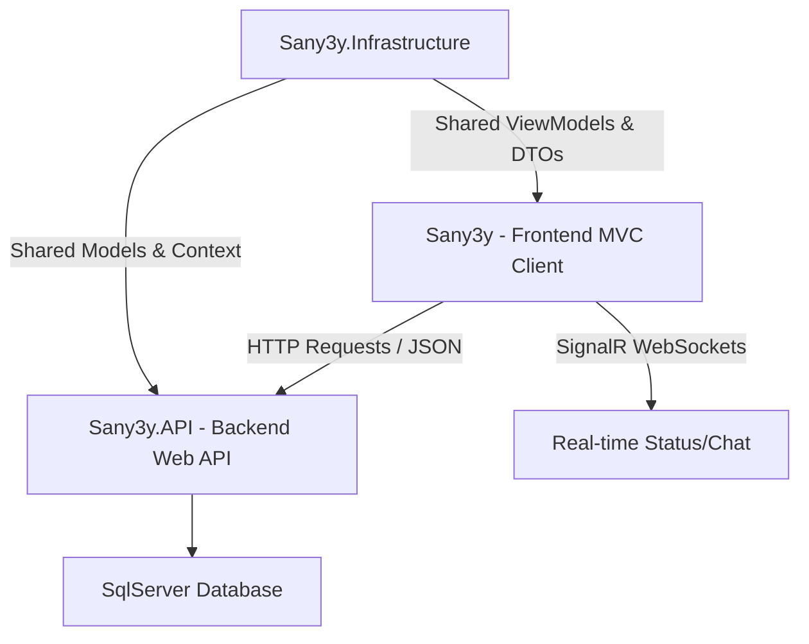

# توثيق مشروع "صنايعي" (عمَّال) البرمجي المتكامل
> [!NOTE]
> هذا الملف يحتوي على شرح شامل لهندسة وتفاصيل المشروع البرمجية والميزات المطبقة فيه، بالإضافة إلى تحليل الفروق بين نمط MVC وإطار عمل Angular.

---

## 1. مقدمة ونظرة عامة على المشروع (Project Overview)
مشروع **"صنايعي" (عمَّال)** هو منصة ويب متكاملة مصممة خصيصاً للسوق المصري بهدف تسهيل عملية الوصول للفنيين المهرة (صنايعية) وأصحاب المحلات الخدمية (مثل الكهرباء، السباكة، النجارة، أعمال التكييف وغيرها) وحجز خدماتهم بسهولة تامة.

يوفر المشروع واجهتين رئيسيتين:
1. **واجهة العملاء (Clients)**: للبحث عن الفنيين والاطلاع على تقييماتهم وحجز مواعيد معهم والتواصل المباشر عبر المحادثات الفورية.
2. **واجهة الفنيين وأصحاب المحلات (Technicians & Shops)**: لإدارة حساباتهم الشخصية، تحديد أسعار المعاينة، وتحديد جداول أوقات العمل المتاحة للحجز، والتفاعل مع طلبات العملاء.
3. **لوحة التحكم للمدير (Admin Dashboard)**: للتحكم الكامل في المستخدمين، مراجعة وتقييم طلبات تفعيل الحسابات، وإدارة التصنيفات.

---

## 2. البنية البرمجية وهندسة النظام (System Architecture)
تم تصميم المشروع باتباع بنية الخدمات المفصولة (Separated Services Architecture) لتقسيم المسؤوليات وتسهيل الصيانة والتطوير المستقبلي. ينقسم الكود المصدري إلى ثلاثة مشاريع رئيسية داخل الحل (Solution):

### أ. مشروع قاعدة البيانات والنماذج `Sany3y.Infrastructure`:
- يحتوي على نماذج البيانات البرمجية (Domain Models) التي تمثل جداول قاعدة البيانات.
- يحتوي على كود سياق الاتصال بقاعدة البيانات (`AppDbContext`) والتكوينات البرمجية لعلاقات الجداول (Fluent API).
- يحتوي على فئات البيانات المشتركة (DTOs) ونماذج الواجهات (ViewModels) المستخدمة لنقل البيانات بين الواجهة والباك اند.

### ب. مشروع الباك اند `Sany3y.API`:
- يمثل محرك الأعمال الفعلي (Core Business Logic).
- يوفر نقاط نهاية برمجية (RESTful API Endpoints) آمنة وموثقة للتعامل مع قاعدة البيانات بشكل غير مباشر.
- مسؤول عن معالجة التوثيق الأمني والمصادقة (Identity & Token Generation).

### ج. مشروع الفرونت اند وعميل الويب `Sany3y` (MVC Client):
- يمثل واجهة المستخدم وتجربة التصفح.
- يتصل بالباك اند عبر عميل HTTP مُهيأ (`HttpClient`) لإرسال واستقبال البيانات بصيغة JSON وعرضها ديناميكياً.
- يعتمد على محرك العرض **Razor Views (.cshtml)** لتوليد واجهات المستخدم على الخادم قبل إرسالها للمتصفح.

---

## 3. شرح تفصيلي لنمط MVC ومقارنة مع Angular

### ما هو نمط الـ MVC (Model-View-Controller)؟
هو نمط هندسي كلاسيكي شهير لتصميم واجهات وتطبيقات الويب، يعتمد على فصل التطبيق إلى ثلاثة أجزاء رئيسية:
1. **النموذج (Model)**: يمثل البيانات الحقيقية وقواعد العمل (مثل التحقق من صحة المدخلات وجلب البيانات من الـ API أو قاعدة البيانات).
2. **العرض (View)**: هو الواجهة المرئية التي يتفاعل معها المستخدم (مثل ملفات Razor `.cshtml` التي تحتوي على أكواد HTML و CSS و JavaScript).
3. **التحكم (Controller)**: هو العقل المدبر الذي يستقبل طلبات المستخدم من المتصفح، ويقوم باستدعاء النماذج لمعالجة البيانات، ثم يمرر النتيجة إلى العرض المناسب لتوليد الصفحة النهائية وإعادتها للمستخدم.

---

### لماذا اخترنا نمط MVC وليس إطار عمل Angular؟

عند تصميم تطبيقات الويب، هناك طريقتان أساسيتان لبناء الواجهات: إما توليد الصفحات في السيرفر (Server-Side Rendering - SSR) مثل **MVC**، أو توليدها بالكامل في المتصفح باستخدام إطارات عمل جافا سكريبت (Client-Side Rendering - CSR) مثل **Angular**.

لقد تم اختيار نمط **MVC** في هذا المشروع للعديد من الأسباب التقنية والتنفيذية الاستراتيجية:

| وجه المقارنة | نمط الـ MVC (ASP.NET Core MVC) | إطار عمل Angular (Single Page App) |
| :--- | :--- | :--- |
| **طريقة التوليد (Rendering)** | **توليد خادمي (SSR)**: يتم معالجة وتجهيز كود HTML بالكامل على السيرفر ويرسل للمتصفح جاهزاً للعرض. | **توليد عميل (CSR)**: يرسل السيرفر ملف HTML فارغ تقريباً مع ملفات JS ضخمة، ويقوم متصفح المستخدم ببناء وتوليد الواجهة. |
| **تحسين محركات البحث (SEO)** | **ممتاز جداً وتلقائي**: تقرأ محركات البحث (مثل Google و Bing) محتوى الصفحات فوراً لأنها تصلها نصوص HTML كاملة، مما يرفع ترتيب الموقع في نتائج البحث. | **معقد ويحتاج لإعدادات إضافية**: تحتاج محركات البحث لتنفيذ كود الجافا سكريبت أولاً لقراءة المحتوى، مما قد يؤدي لعدم أرشفة الصفحات ديناميكياً بشكل صحيح إلا باستخدام تقنيات معقدة مثل Angular Universal. |
| **سرعة التحميل الأولي** | **سريع جداً**: تظهر الصفحة فوراً للمستخدم حتى على الشبكات والأجهزة الضعيفة لأن المتصفح لا يقوم بأي عمليات معالجة معقدة. | **أبطأ في التحميل الأول**: يحتاج المتصفح لتحميل حزمة الأكواد الكبيرة (Bundle) وتشغيلها قبل عرض أي شيء للمستخدم. |
| **أمان الكود البرمجي (Security)** | **أمان مطلق**: كود الواجهات والتحقق والمنطق يجري في السيرفر، فلا يمكن للعميل رؤية طريقة استدعاء الـ APIs أو مفاتيح الربط الحساسة. | **أقل أماناً على مستوى العميل**: كود الفرونت اند بالكامل متاح للمعاينة والتفتيش (Inspect Element)، مما يسهل قراءة مسارات التطبيق وهندسته الداخلية. |
| **سهولة التطوير والدمج** | **بسيطة ومدمجة**: يتم كتابة الفرونت اند والباك اند بلغة C# وبيئة دوت نت واحدة، مما يسهل مشاركة الـ ViewModels وإدارتها دون تشتت. | **فصل كامل للمشروعين**: يتطلب بناء مشروعين منفصلين تماماً، وإدارة مسار نشر (Deployment) منفصل للفرونت اند والباك اند ومشاكل الـ CORS. |

> [!TIP]
> **الخلاصة**: بما أن مشروع "صنايعي" يحتاج لظهور فوري في محركات البحث لجلب الزوار (SEO)، وبما أن شريحة كبيرة من المستخدمين في مصر قد يتصفحون الموقع من هواتف وأجهزة متوسطة وشبكات إنترنت متغيرة السرعة، فإن **MVC** هو الخيار المثالي لتقديم أداء سريع وأرشفة ممتازة وتكلفة تشغيل خوادم أقل بكثير مقارنة بـ Angular.

---

## 4. تفصيل خدمات الباك اند وقاعدة البيانات (Backend details)

يتكون الباك اند في مشروع `Sany3y.API` من معمارية منظمة تعتمد على الـ Controllers لتقديم خدمات الـ Web API بشكل آمن وفعال.

### أ. قاعدة البيانات ونموذج العلاقات (Database Schema):
يعتمد المشروع على محرك SQL Server لإدارة البيانات مستخدماً تقنيات الـ Code-First من Entity Framework Core. وتتكون قاعدة البيانات من الجداول الرئيسية التالية:
- **`AspNetUsers`**: الجدول المركزي لجميع الحسابات في النظام (عملاء، فنيين، مدراء)، ويرث من `IdentityUser` لإدارة كلمات المرور والمصادقة.
- **`Addresses`**: لتخزين تفاصيل العناوين (المحافظة، المدينة، الشارع) وتوفير نطاق جغرافي دقيق للبحث.
- **`Categories`**: يحتوي على تصنيفات الحرف مثل (سباكة، كهرباء، نجارة، نقاشة، تبريد وتكييف، صيانة أجهزة).
- **`Ratings`**: لحفظ تقييمات العملاء للفنيين والتعليقات الخاصة بهم لحساب متوسط التقييم التلقائي.
- **`Messages`**: لحفظ الرسائل المرسلة والمستقبلة في نظام المحادثات اللحظية.
- **`TechnicianSchedules`**: لتنظيم وإدارة فترات ومواعيد العمل المتاحة للحجز لكل فني (التاريخ، وقت البدء، وقت الانتهاء، وهل تم الحجز أم لا).
- **`Payments`**: لحفظ سجل عمليات الدفع النقدية وتفاصيلها المادية لضمان توثيق الحجوزات.
- **`Governorates` / `Cities`**: جداول جغرافية مسبقة التعبئة لتسهيل اختيار المدن والمحافظات في مصر.

---

### ب. نقاط النهاية البرمجية (API Controllers & Endpoints):
يحتوي الباك اند على 16 وحدة تحكم (Controllers) تقدم الخدمات التالية:
1. **`UserController`**: يدير عمليات تسجيل الحسابات الجديدة وتدقيق بيانات الدخول والمصادقة وتحديث حالة الاتصال (Online/Offline) للمستخدمين.
2. **`TechnicianController`**: يدير استعلامات البحث المتقدمة للفنيين حسب المدينة والمحافظة والتصنيف المهني، وعرض بيانات الفني الشخصية وسعر المعاينة.
3. **`TechnicianScheduleController`**: يتيح للفنيين إضافة وحذف مواعيد عملهم، ويتيح للعملاء الاستعلام عن المواعيد المتاحة لحجزها.
4. **`DashboardController`**: يجمع الإحصائيات والأرقام الهامة لكل مستخدم بناءً على دوره (عدد العملاء، الأرباح الكلية، المهام المعلقة والمنجزة) لعرضها في لوحات التحكم.
5. **`MessageController`**: يتعامل مع عمليات جلب سجل المحادثات وحفظ الرسائل الجديدة بين المستخدمين في قاعدة البيانات.
6. **`AddressController`**: لإضافة وتحديث وتعديل عناوين المستخدمين المسجلة في قاعدة البيانات.
7. **`CategoryController`**: للتحكم بقائمة التخصصات والحرف وتعديل أسمائها وخصائصها.
8. **`CountryServicesController`**: يتيح جلب قوائم المحافظات والمدن المصرية لعرضها للمستخدم عند اختيار موقعه الجغرافي.
9. **`RatingController`**: يستقبل التقييمات الجديدة ويقوم بحساب وعرض متوسط تقييم كل فني تلقائياً.
10. **`NotificationController`**: لتسجيل الإشعارات الخاصة بالعمليات البرمجية وعرضها للمستخدمين (مثل إشعار بحجز موعد جديد).
11. **`PaymentController`**: يسجل عمليات حجز الخدمات وتأكيد الدفع النقدي وتحديث حالات المهام.

---

## 5. الميزات البرمجية المدمجة في المشروع (Features)

المشروع مليء بالميزات والخصائص الذكية التي تم دمجها وتحسينها لتوفر تجربة مستخدم مثالية وخالية من التعقيد:

### 🔑 نظام التوثيق والمصادقة المرن (Authentication & Identity):
- استخدام مدمج لنظام `ASP.NET Core Identity` لتشفير كلمات المرور وإدارة الجلسات وحماية الصفحات حسب الأدوار (Role-Based Authorization).
- **تحسين تسجيل الدخول**: تم توسيع الحروف المسموح بها لاسم المستخدم لتشمل الأحرف العربية والمسافات والإنجليزية، مما يمنع المشاكل الشائعة التي تواجه المستخدمين عند كتابة أسمائهم بالعربية.
- **إلغاء تفعيل حسابات البريد الإلزامية مؤقتاً**: تم تفعيل تأكيد البريد الإلكتروني تلقائياً للمسجلين الجدد لتسهيل الدخول الفوري دون توقف في شاشة انتظار رسائل التأكيد.

### 📧 التحقق واستعادة كلمة المرور الفعلي (Email OTP via SMTP & MemoryCache):
- نظام متطور وآمن لاستعادة كلمات المرور عند نسيانها:
  1. يقوم المستخدم بكتابة بريده الإلكتروني (Gmail).
  2. يقوم النظام بتوليد رمز تحقق عشوائي ذو أمان عالٍ مكون من 6 أرقام (OTP).
  3. يتم تخزين هذا الرمز بأمان تام في ذاكرة الخادم المؤقتة **`IMemoryCache`** وربطه بالبريد الإلكتروني مع تحديد وقت صلاحية صارم وهو **5 دقائق** فقط، مما يمنع تخزين الرموز غير المستخدمة في قاعدة البيانات ويسرع التحقق.
  4. يتم إرسال الرمز فوراً في رسالة بريد إلكتروني منسقة وجذابة عبر بروتوكول SMTP الخاص بـ Gmail باستخدام بريد المنصة المعتمد: `mohamed2atef2015@gmail.com`.

### 💳 بوابة الدفع النقدي الذكية (Cash-Only Payments):
- للتوافق مع طبيعة الخدمات المنزلية في مصر، تم إلغاء بوابات الدفع الإلكتروني المعقدة (Stripe / Online) وتعميم نظام **الدفع النقدي (Cash Only)** لجميع الخدمات والمحلات مع إبقاء التوافق البرمجي لبيانات الحجز وسير المعاملات المادية ثابتاً لمنع حدوث أي أخطاء برمجية.

### 🖼️ معالجة مرنة لرفع المستندات (Bypassed OCR ID Verification):
- لتسريع عملية انضمام الفنيين الجدد للموقع ومنع رفض التسجيل بسبب عدم وضوح الصور المرفوعة للبطاقات القومية باللغة العربية، تم الاستغناء عن التحقق الآلي بالذكاء الاصطناعي (OCR Service) والاكتفاء بكتابة الرقم القومي المكون من 14 رقماً رقمياً للتحقق اليدوي لاحقاً، مما جعل عملية التسجيل سريعة ومرنة.

### 💬 المحادثات اللحظية وحالة المستخدمين (Real-Time Communication via SignalR):
- دمج تقنية WebSockets من خلال مكتبة **`SignalR`** لتوفير:
  * شات فوري بين العملاء والفنيين داخل الموقع مباشرة.
  * مؤشرات ضوئية تفاعلية لتحديث حالة المستخدمين (Online/Offline) بشكل لحظي ودقيق بمجرد دخولهم أو خروجهم من الموقع.

### 🎨 الواجهات الغنية ثلاثية الأبعاد (Modern Glassmorphic 3D UI/UX):
- تم استخدام أحدث صيحات التصميم في واجهات الموقع:
  * تصميم زجاجي عصري (Glassmorphism) بخلفيات ناعمة وتأثيرات Blur مميزة.
  * إضافة تأثير ظل ثلاثي الأبعاد فاخر (Layered Sky-Blue 3D Glow Shadow) يمنح كروت وصناديق الموقع أبعاداً جمالية بارزة ومريحة للعين.
  * تنسيق هرمي رائع للألوان يعتمد على النيون السماوي (`#00d2ff`) والبنفسجي، مع نجوم تقييم مميزة باللون الأصفر النيون الجذاب لراحة العين في التصفح وسرعة قراءة التقييمات.
  * تحسين عرض كروت الفنيين في الصفحة الرئيسية لتعرض تخصص وموقع الفني مباشرة تحت صورته الشخصية لضمان وصول سريع للمعلومات الأساسية.
